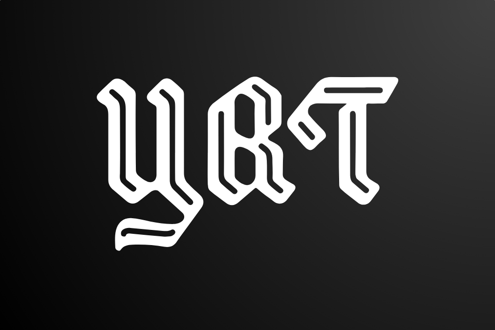
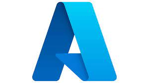

<h1 align="center"> TEAM YRT <h1>

  

## 📋 Table of contents
  - [Description](#description)
  - [Documentation](#docs)
  - [How to run](#install)
  - [Technologies](#technologies)
  - [Collaborators](#collaborators)

## 🔍 Description 

 Our application represents the future of digital wills, combining innovative features for both traditional and digital assets. To read more please visit our <a href="https://github.com/IVAndreev21/YRT/wiki/Summary">wiki</a> 

## 📃 Documentation 
### Code & Team Documentation

[Team Documentation](https://github.com/IVAndreev21/YRT/blob/main/Documents/YRT_Documentation.docx)

### QA Documentation
[QA Documentation](https://github.com/IVAndreev21/YRT/blob/main/Documents/YRT_QA_documentation.xlsx)
  

### Presentation
[Presentation](https://github.com/IVAndreev21/YRT/blob/main/Documents/YRT.pptx)

## 🚀 How to run 
## For proper installation and setp please follow our installation page in our <a href="https://github.com/IVAndreev21/YRT/wiki/How-to-download">wiki</a>  

## 🖥️ Technologies used 
### IDE & version control system:
  

### Programming languages & third-party libraries:
    

### Tools used for documentation, presentation & communication:
   

### PARTNERS:

## 🧑 Collaborators 
- [Ivan Andreev](https://github.com/IVAndreev21) - Scrum trainer 
- [Boyan Kyovtorov](https://github.com/BKKyovtorov21) - Back-end Developer
- [Dimitar Dimov](https://github.com/DRDimov21) - Front-end Developer
- [Dobril Peev](https://github.com/DDpeev21) - Designer
